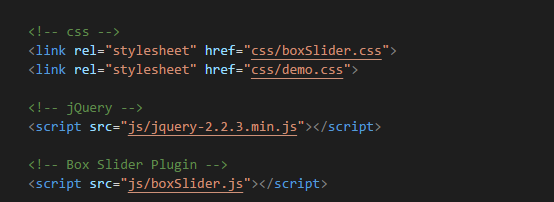
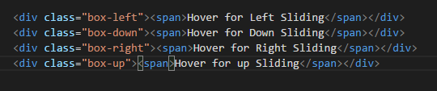
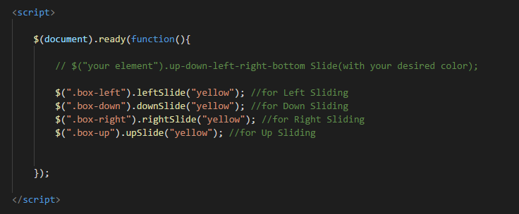

# boxSliderPlugin

# documentation

Add the Plugin script under your jQuery file:

After that just add your container into your html file:

Just initialize the plugins methods with your desired color of yours:

And you're ready to go!
